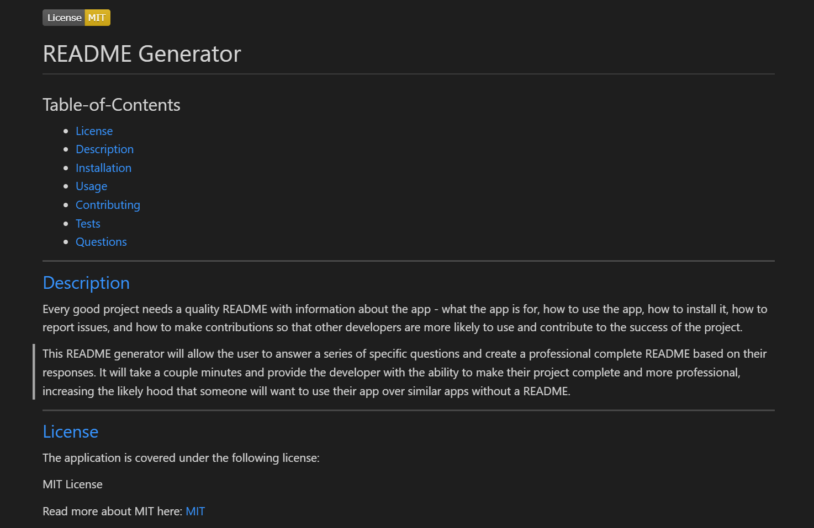
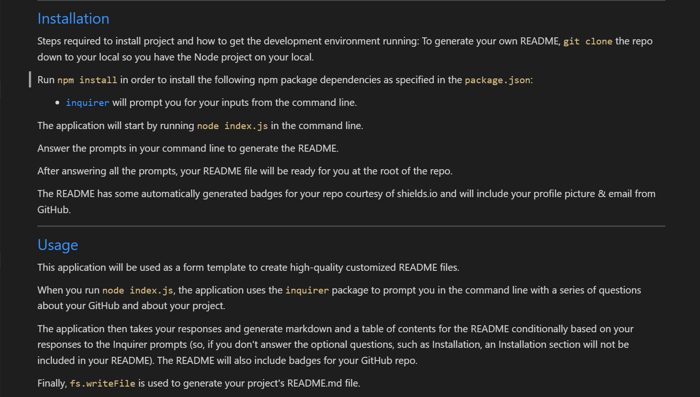
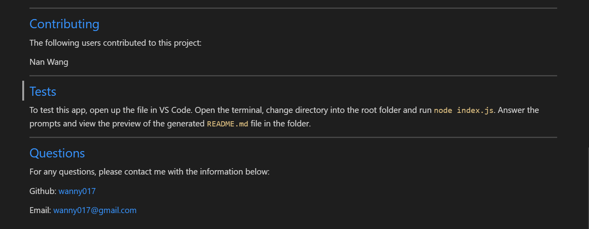

 

  
  # README Generator
  
  ## Table-of-Contents
  * [License](#license)
  * [Description](#description)
  * [Installation](#installation)
  * [Usage](#usage)
  * [Contributing](#contributing)
  * [Tests](#tests)
  * [Questions](#questions)
  ---

  ## [Description](#table-of-contents)
  Every good project needs a quality README with information about the app - what the app is for, how to use the app, how to install it, how to report issues, and how to make contributions so that other developers are more likely to use and contribute to the success of the project.
  
  This README generator will allow the user to answer a series of specific questions and create a professional complete README based on their responses. It will take a couple minutes and provide the developer with the ability to make their project complete and more professional, increasing the likely hood that someone will want to use their app over similar apps without a README.

  ---

  ## [License](#table-of-contents)
  The application is covered under the following license:
  
  MIT License

  Read more about MIT here:
  [MIT](https://opensource.org/licenses/MIT)

  ---

  ## [Installation](#table-of-contents)
  Steps required to install project and how to get the development environment running:
  To generate your own README, `git clone` the repo down to your local so you have the Node project on your local.

  Run `npm install` in order to install the following npm package dependencies as specified in the `package.json`:

  * [`inquirer`](https://www.npmjs.com/package/inquirer) will prompt you for your inputs from the command line.
  
  The application will start by running `node index.js` in the command line.

   Answer the prompts in your command line to generate the README.

   After answering all the prompts, your README file will be ready for you at the root of the repo.
   
   The README has some automatically generated badges for your repo courtesy of shields.io and will include your profile picture & email from GitHub.

---

  ## [Usage](#table-of-contents)
  This application will be used as a form template to create high-quality customized README files.

  

  When you run `node index.js`, the application uses the `inquirer` package to prompt you in the command line with a series of questions about your GitHub and about your project.

  The application then takes your responses and generate markdown and a table of contents for the README conditionally based on your responses to the Inquirer prompts (so, if you don't answer the optional questions, such as Installation, an Installation section will not be included in your README). The README will also include badges for your GitHub repo.

  Finally, `fs.writeFile` is used to generate your project's README.md file. 

  ---

  ## [Contributing](#table-of-contents)
  The following users contributed to this project:

  Nan Wang

  ---

  ## [Tests](#table-of-contents)
  To test this app, open up the file in VS Code. Open the terminal, change directory into the root folder and run `node index.js`. Answer the prompts and view the preview of the generated `README.md` file in the folder.
  
  Here are some screenshot of generated README:

  

  

  
  
  ---

  ## [Questions](#table-of-contents)
  For any questions, please contact me with the information below:

  Github: [wanny017](https://github.com/wanny017)

  Email: <a href="mailto:wanny017@gmail.com">wanny017@gmail.com</a>
